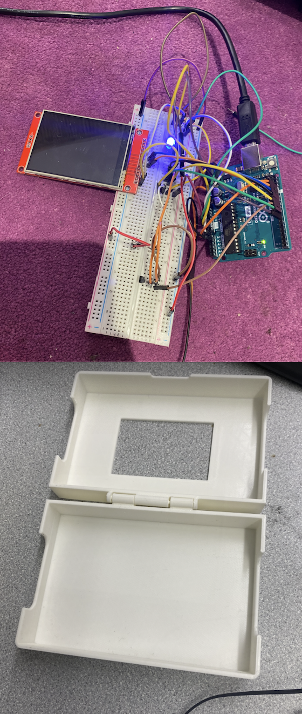
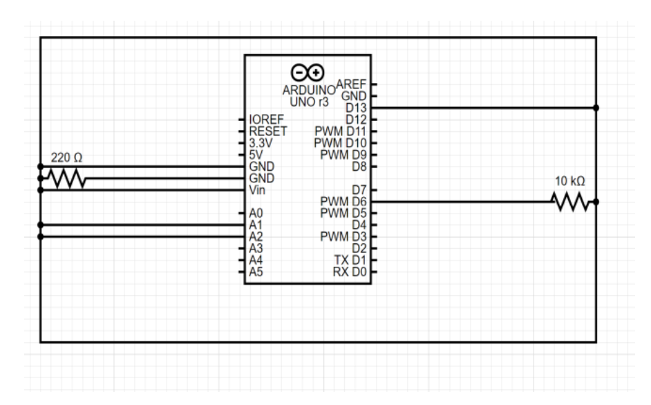
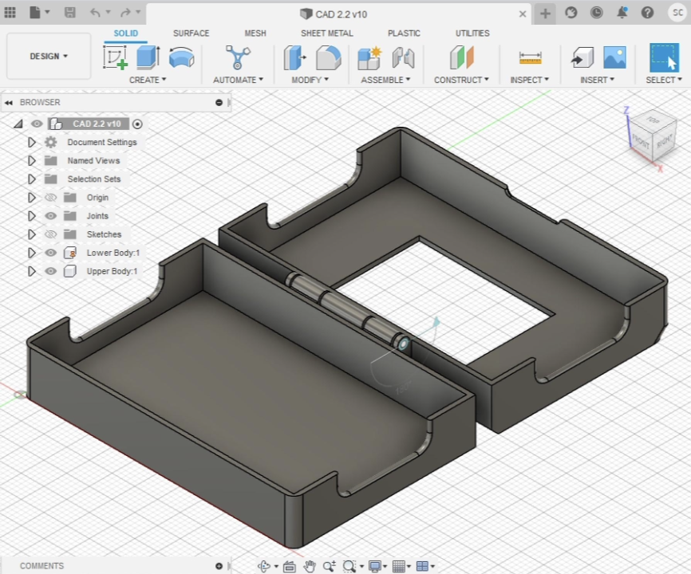

# RAD Smart Home Safety Device

Prototype smart home safety system designed to detect fire and flood risks and automatically shut off connected devices.

---

## Project Structure

```
rad-smart-home-safety-device
│
├ code
│ └ arduino_sensor_system.ino
│
├ images
│ ├ cad-design.png
│ ├ circuit-diagram.png
│ ├ code-flow-chart.png
│ ├ prototype.png
│ └ schematic-diagram.png
│
├ Engineering_Notebook.pdf
├ RAD_Final_Report.pdf
└ README.md
```

---

## Overview

This project was developed as part of the **Rapid Assembly and Design Challenge (RAD)**.  
The goal was to design and prototype a smart home safety device capable of detecting fire and flood risks.

The system uses sensors connected to an **Arduino microcontroller** to monitor environmental conditions. When temperature or water levels exceed predefined thresholds, the system automatically shuts off connected devices to prevent potential hazards.

---

## Key Features

- Temperature monitoring using a **thermistor**
- Water level detection using a **water sensor**
- Automatic shutdown of devices when risk thresholds are detected
- Arduino-based sensor monitoring and control logic
- Custom enclosure designed using **CAD and 3D printing**

---

## System Components

- Arduino microcontroller  
- Thermistor (temperature sensor)  
- Water level sensor  
- LED indicator  
- Water pump  
- Breadboard and wiring  
- 3D printed enclosure

---

## Prototype



---

## Circuit Diagram



---

## CAD Design



---

## Code

Arduino control logic is located in the **code** folder.

```
code/arduino_sensor_system.ino
```

The program reads sensor values from the thermistor and water level sensor and triggers device shutdown when thresholds are exceeded.

---

## Documentation

Full project documentation is available in the **docs** folder.

- Final Design Report  
- Engineering Notebook  

```
docs/RAD_Final_Report.pdf
docs/Engineering_Notebook.pdf
```

---

# Author

Sophia Choi  
Business Technology Management  

Data Analytics • SQL • Tableau • Business Operations Strategy
